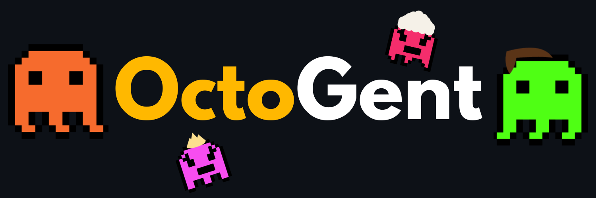

<div align="center">


<br/>
<br/>

<strong>too many terminals, not enough tentacles</strong>
<br />
<br />


[](https://www.typescriptlang.org/)
[](https://nodejs.org/)
[](LICENSE)

</div>

# Hydra

It's really not fun to have **ten opencode sessions open at once**, constantly switching between them and trying to remember what each one was supposed to do. *Things get blurry fast* when one agent is doing documentation, another is touching the database, another is changing the API, and another is somewhere in the frontend. **Hydra** tries to fix that by giving each job its own <u>scoped context, notes, and task list</u>, while also making it possible for opencode to **spawn other opencode agents**, assign them work, and communicate with them.

Hydra runs a **local dashboard + API + PTY runtime** on your machine. Each opencode session runs in its own terminal column with its own context files, todos, transcript, and optional git worktree. You stay at the orchestration layer; the agents do the work.

## One-Click Install

### Windows

1. Install [Node.js 22+](https://nodejs.org) (any LTS) — the installer can do this for you via winget.
2. Double-click **`install.cmd`** in this repo (or run `powershell -ExecutionPolicy Bypass -File install.ps1`).
3. When prompted, let it install **pnpm** and **opencode** automatically.
4. Open a **new** terminal, `cd` into the project you want to orchestrate, and run:

```bat
hydra
```

### macOS / Linux

```bash
git clone https://github.com/middleclassfiles/octopencode.git
cd octopencode
chmod +x install.sh
./install.sh
```

Then, in a new terminal:

```bash
hydra
```

### What the installer does

1. Checks prerequisites: **Node.js 22+, pnpm, opencode, git, gh, curl**
2. Auto-installs anything missing (winget on Windows; npm for pnpm/opencode)
3. Runs `pnpm install` and `pnpm build`
4. Installs the `hydra` CLI globally via `npm install -g .`
5. Verifies the CLI responds

Flags: `--check` (only report prerequisite status), `--skip-build` (reuse existing build), `--yes` (never prompt).

## Requirements

| Tool | Required | Used for |
| --- | --- | --- |
| Node.js 22+ | ✅ | Runtime, API, web UI |
| `opencode` | ✅ | The agent running in every terminal (install: `npm i -g opencode-ai` or https://opencode.ai) |
| `pnpm` | ✅ | Building the repo (installer installs it) |
| `git` | ⚠️ optional | Worktree-backed terminals, branch flows |
| `gh` | ⚠️ optional | GitHub pull request creation/merge from the UI |
| `curl` | ⚠️ optional | opencode plugin event callbacks |

Startup fails only when `opencode` is missing. Git/gh/curl only degrade the features that use them.

## Every Feature

### Agent orchestration

- **Multiple opencode terminals** — run as many parallel opencode sessions as you want, each in its own terminal column with live PTY output (browser-based terminal via xterm.js)
- **Tentacles** — scoped job containers under `.hydra/tentacles/<id>/` with `CONTEXT.md`, `todo.md`, and any extra markdown vault files; the agent's durable working context
- **Todo delegation** — `todo.md` checkbox items become progress and worker inputs; spawn one agent per item
- **Swarms** — launch a whole fleet of workers from incomplete todo items, with a parent coordinator terminal for larger swarms
- **Parent/child orchestration** — a parent opencode agent can spawn child agents, assign them work, and review/merge results
- **Inter-agent messaging** — send short channel messages to any live terminal; they are injected when the target session is idle
- **Worktrees** — optional isolated git checkouts (`.hydra/worktrees/<id>/` on `hydra/<id>` branches) per terminal
- **Git lifecycle** — per-tentacle status, commit, push, sync, pull request creation, and PR merge from the UI or CLI
- **Auto-naming** — generated terminals are named from their first prompt

### Agent visibility

- **Live transcripts** — opencode session data is exported into stored conversations (`opencode export --sanitize`), browsable and exportable as JSON or Markdown
- **Agent state badges** — live status per session: processing, idle, waiting for input, waiting for permission, ended
- **OpenCode plugin bridge** — Hydra writes `.opencode/plugin/hydra-events.js` into the workspace; opencode auto-loads it and reports session, prompt, tool, and idle events to the API
- **Code intel** — tool execution events (edit/write) feed a searchable code-intel log
- **Usage tracking** — cost and token usage per day/7d/30d, read live from the opencode database (`opencode db`), plus a 30-day token usage heatmap per project and model
- **GitHub summary** — commits/day sparkline, repo stars, open issues, open PRs, recent commits, and repo telemetry in the runtime status strip
- **Monitor feed** — an X (Twitter) search monitor with configurable query terms, credentials, refresh, and cached feed

### Interface

- **Deck view** — tentacle cards with description, vault files, todo progress, suggested opencode skills, colors, and status
- **Canvas view** — graph-based view of tentacles and opencode sessions with open panels
- **Prompts library** — built-in and user prompt templates with variable interpolation; create/edit/delete from the UI
- **Terminal columns** — resize, minimize, rename, multi-pane browser terminals with scrollback, hotkeys, and completion sounds
- **Workspace setup wizard** — first-run card that verifies `.hydra` scaffold, `.gitignore`, opencode, git, and curl step by step
- **Hotkeys** — keyboard-first navigation across the dashboard

### Platform

- **Local API + WebSocket runtime** — loopback-bound HTTP API and WebSocket terminal streaming, secured by default
- **Persistence** — terminal registry, transcripts, monitor cache, deck metadata, UI state, and usage snapshots survive restarts under `~/.hydra/projects/<id>/state/`
- **Stale recovery** — terminal records persisted as running are reconciled to `stale` on restart with lifecycle reasons; `hydra terminal prune` cleans them up
- **Multi-project** — register unlimited projects, each with isolated state, via the `hydra` CLI
- **CLI** — full command surface: init, projects, tentacles, terminals, channels (see below)

## Quick start

### 1. Start the dashboard

```bash
hydra
```

The first run creates `.hydra/` in the current directory, registers the project, picks an open local port (starting at 8787), and opens the browser. Set `HYDRA_NO_OPEN=1` to skip the browser, or `HYDRA_ALLOW_REMOTE_ACCESS=1` to bind beyond loopback.

### 2. Create a tentacle

From the CLI (with Hydra running):

```bash
hydra tentacle create api-backend --description "API runtime and request handling"
```

Or use the Deck view → Create tentacle. A tentacle becomes `.hydra/tentacles/api-backend/` with `CONTEXT.md` and `todo.md`.

### 3. Let the agent build the context

The tentacle files are the job's memory: `CONTEXT.md` for the local model of the area, `todo.md` for concrete tasks, extra markdown for notes and handoffs. opencode reads and updates them as work moves forward.

### 4. Create a terminal

```bash
hydra terminal create --name "API worker" --tentacle-id api-backend
```

Add `--workspace-mode worktree` for an isolated git worktree, or `--prompt-template tentacle-planner` to boot with a planner prompt.

### 5. Delegate from todos

In Deck, solve a todo item or launch a swarm. Incomplete items in `todo.md` become worker prompts; larger swarms get a parent coordinator.

### 6. Message an agent

```bash
hydra channel send terminal-2 "Need review on the request parser changes"
```

The message is queued and injected into that terminal when it is idle.

## CLI Reference

```
hydra                               Start the dashboard in the current project
hydra init [project-name]           Initialize the current directory explicitly
hydra projects                      List registered projects

hydra tentacle create <name>        Create a tentacle (Hydra must be running)
  --description <text>                Tentacle description
hydra tentacle list                 List tentacles

hydra terminal create [options]     Create a terminal
  --name, -n <name>                   Terminal display name
  --workspace-mode, -w <mode>         shared | worktree
  --initial-prompt, -p <text>         Raw initial prompt
  --terminal-id <id>                  Explicit terminal ID
  --tentacle-id <id>                  Existing tentacle to attach to
  --worktree-id <id>                  Explicit worktree ID
  --parent-terminal-id <id>           Parent terminal for child terminals
  --prompt-template <name>            Prompt template name
  --prompt-variables <json>           JSON object of template variables
hydra terminal list                 List terminal lifecycle state
hydra terminal stop <id>            Stop a terminal session
hydra terminal kill <id>            Kill a terminal session or recorded process
hydra terminal prune                Remove stale, stopped, exited records

hydra channel send <id> <message>   Send a channel message to a terminal
hydra channel list <id>             List channel messages
```

Environment variables: `HYDRA_NO_OPEN` (skip browser), `HYDRA_MAX_TERMINAL_SESSIONS` (PTY cap, default 32), `HYDRA_ALLOW_REMOTE_ACCESS`, `HYDRA_API_ORIGIN`/`HYDRA_API_PORT` (dev), `HYDRA_WORKSPACE_CWD`, `HYDRA_PROJECT_STATE_DIR` (dev), `HYDRA_PROMPTS_DIR` (dev), `HYDRA_DEV_START_PORT` (dev).

## Manual install (from a clone)

```bash
git clone https://github.com/middleclassfiles/octopencode.git
cd octopencode
pnpm install
pnpm build
npm install -g .
hydra
```

For local development instead of a global install:

```bash
pnpm install
pnpm dev
```

`pnpm dev` runs the API and web app with hot reload and a free port from 8787 upward.

Verify the environment any time with:

```bash
node scripts/install.mjs --check
```

## How It Works

Hydra separates three concerns that usually get mixed together in a pile of terminals:

1. **Context** lives in `.hydra/tentacles/<tentacle-id>/`. `CONTEXT.md` explains the area, `todo.md` supplies executable work items, and extra markdown files hold notes or handoffs.
2. **Execution** lives in terminal records and PTY sessions managed by the local API. A terminal can attach to an existing tentacle, and several terminals can share one tentacle during swarm work.
3. **Isolation** is optional. Shared terminals run in the main workspace; worktree terminals run under `.hydra/worktrees/<worktree-id>/` on `hydra/<worktree-id>` branches.

Deck reads the tentacle files directly, parses checkbox items from `todo.md`, and uses incomplete items to generate worker prompts. Hydra's opencode plugin (`<workspace>/.opencode/plugin/hydra-events.js`) reports session, prompt, tool, and idle events back to the local API so the UI can show more than raw terminal output. Usage and heatmap data come straight from the opencode database; transcripts are exported from opencode sessions and stored as conversations.

## What persists

- `.hydra/` keeps the project scaffold and worktrees
- `~/.hydra/projects/<project-id>/state/` keeps the terminal registry, transcripts, monitor cache, deck metadata, UI state, usage snapshots, and runtime metadata
- `.hydra/tentacles/<tentacle-id>/` keeps the context files and todos that agents read

PTY sessions survive browser reloads during the idle grace period, but they do **not** survive an API restart. Hydra marks previously running terminal records as `stale` on startup when it cannot reattach them to a live PTY session; use `hydra terminal list`, `stop`, `kill`, and `prune` to inspect and clean them up. Hydra caps live PTY sessions at 32 by default; set `HYDRA_MAX_TERMINAL_SESSIONS` to a positive integer to tune that limit.

## Troubleshooting

- **`hydra` is not recognized** — the npm global bin directory is not on PATH (or you need a new terminal). The installer prints the directory at the end.
- **Startup fails: opencode not found** — install it (`npm i -g opencode-ai`, or follow https://opencode.ai) and re-run `node scripts/install.mjs`.
- **Port already in use** — Hydra scans upward from 8787 automatically; `HYDRA_DEV_START_PORT` overrides the start for dev runs.
- **Terminal shows `stale`** — the API restarted while the session was running; stop/kill/prune the record with the CLI.
- **Usage shows NA** — no opencode sessions recorded yet in the opencode database, or `opencode` is not on the API's PATH.
- **Worktree PR flows don't work** — `gh` is missing or not authenticated (`gh auth login`).

See [Troubleshooting](docs/reference/troubleshooting.md) for the full guide.

## Docs

- [Docs Home](docs/index.md)
- [Installation](docs/getting-started/installation.md)
- [Quickstart](docs/getting-started/quickstart.md)
- [Mental Model](docs/concepts/mental-model.md)
- [Tentacles](docs/concepts/tentacles.md)
- [Runtime and API](docs/concepts/runtime-and-api.md)
- [Working With Todos](docs/guides/working-with-todos.md)
- [Orchestrating Child Agents](docs/guides/orchestrating-child-agents.md)
- [Inter-Agent Messaging](docs/guides/inter-agent-messaging.md)
- [CLI Reference](docs/reference/cli.md)
- [Filesystem Layout](docs/reference/filesystem-layout.md)
- [API Reference](docs/reference/api.md)
- [Experimental Features](docs/reference/experimental-features.md)
- [Troubleshooting](docs/reference/troubleshooting.md)

## Contributor setup

Hydra is not actively reviewing pull requests right now. If you still open one and any code was written with AI, disclose which coding agent and model were used. For contributor workflow and expectations, see [CONTRIBUTING.md](CONTRIBUTING.md).

## License

[MIT](LICENSE)
